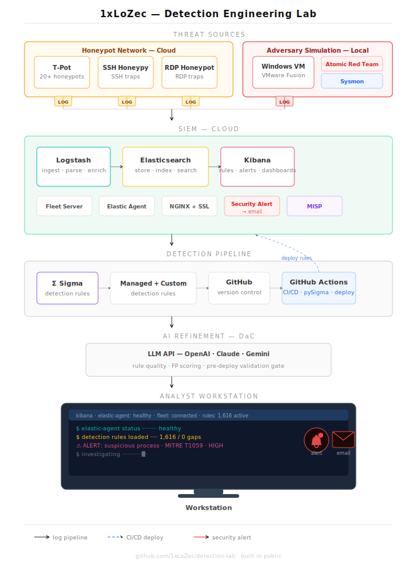

# detection-lab

ELK Stack, Honeypots, Threat Simulation, Detection Rules. 
Built from scratch, documented in real time.

---

Professionally I make artisan sandwiches. On my own time 
I build detection engineering labs from scratch because 
apparently that is what I do for fun.

This lab is where I go deeper on the infrastructure side 
of detection engineering. Building everything from the 
ground up so I actually understand what is happening under 
the hood, not just on the screen.

Everything here is documented as I build it. That includes 
the parts that break, the walls I hit, and how I got through 
them. This is not a finished product. It is a live build.

---

## The Stack

| Component | Technology | Status |
|---|---|---|
| SIEM | Elastic Stack 8.19 | Live |
| Log Collection | Elastic Agent | Up Next |
| Honeypot Network | T-Pot | Planned |
| Threat Simulation | Atomic Red Team | Planned |
| Detection Rules | Sigma | Planned |
| CI/CD Pipeline | GitHub Actions | Planned |
| Threat Intelligence | MISP | Planned |

---

## Progress

- April 24 2026 — Repository created. ELK stack deployed, 
secured, and accessible at https://1xlozec.com. Firewall 
configured. SSL certificate installed. Kibana is live.
- April 24 2026 — Elasticsearch verified responding correctly. 
  Cluster name 1xlozec-lab confirmed. Node elk-node-01 confirmed.

- April 24 2026 — First logs flowing into Kibana. 704 documents ingested from server telemetry. Elastic Agent enrolled and healthy in Fleet.

- April 24 2026
    - Full ELK stack deployed and secured on DigitalOcean
    - Ubuntu server patched and firewall configured
    - Elasticsearch 8.19 running and verified
    - Kibana live at https://1xlozec.com with SSL via NGINX
    - Fleet Server running and healthy
    - Elastic Agent enrolled and shipping live telemetry
    - 1,616 Elastic prebuilt detection rules installed with zero gaps
    - GitHub repository live and documented

- April 24 2026 — WireGuard VPN fully configured with split DNS. Kibana accessible only through encrypted VPN tunnel. Domain resolves correctly through VPN. Blocked on public internet. Infrastructure hardened and ready for Phase 4.

- April 24 2026 — Windows 11 ARM VM deployed in VMware Fusion. Sysmon installed with SwiftOnSecurity config using the ARM64 native binary (Sysmon64a). Elastic Agent enrolled and healthy. Windows VM shipping telemetry to ELK stack. Network isolated to private only. Snapshots taken at clean install and post-enrollment. Phase 4 complete. Atomic Red Team next.

- April 25 2026 — Hit a wall with VMware. Dug into it, found out Broadcom is shipping incomplete installers. Not a config issue, the files are literally missing. Fixed a DNS issue while I was in there and kept moving.

- April 28 2026 — Decided to do it right. Replaced the ISP router and mesh WiFi with enterprise grade gear. Bought a dedicated machine for Proxmox. Proper network segmentation is in place. Attack environment is locked down. Waiting on hardware to finish the build.

## Lab Access

Live Kibana dashboard: https://1xlozec.com

---

*Built by 1xLoZec. Work in progress. Check back often.*
