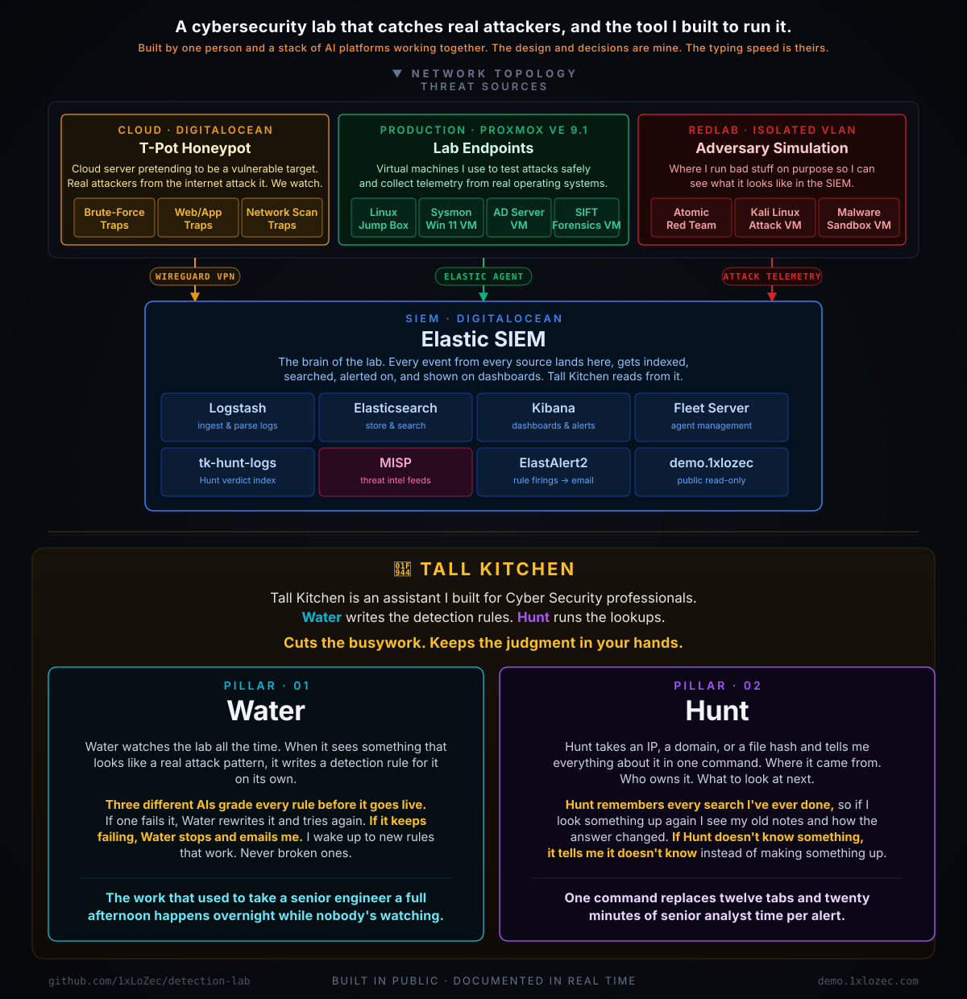

*Network topology: VLAN-segmented home lab feeding a cloud SIEM through a WireGuard tunnel.*

# 1xLoZec Detection Lab

**Autonomous detection engineering pipeline. Built from scratch, documented in real time.**

[](https://github.com/1xLoZec/detection-lab/actions)
[](https://github.com/1xLoZec/detection-lab/tree/main/detections/sigma)
[](#h4voc_water)
[](https://www.elastic.co/)
[](LICENSE)

**[🖥️ Live Dashboard](https://demo.1xlozec.com) · [🗺️ ATT&CK Coverage Heatmap](https://mitre-attack.github.io/attack-navigator/#layerURL=https://raw.githubusercontent.com/1xLoZec/detection-lab/main/docs/coverage_layer.json) · [⚡ h4voc_water Pipeline](#h4voc_water)**

---

Professionally I make artisan sandwiches. On my own time I build detection engineering labs from scratch because apparently that is what I do for fun.

This lab is where I go deeper on the infrastructure side of detection engineering — building everything from the ground up so I actually understand what's happening under the hood, not just on the screen. Everything is documented as I build it, including the parts that break, the walls I hit, and how I got through them. This is not a finished product. It is a live build.

## Lab Access

**Live dashboard:** [demo.1xlozec.com](https://demo.1xlozec.com)
**Username:** `demo`
**Password:** `DemoUser2026!`

Read-only viewer account. Dark mode is on by default. Time range is locked to the last 3 months. Anyone can view the lab without VPN.

## The Stack

**Live components:**

| Component | Technology |
|---|---|
| SIEM | Elastic Stack 8.19 |
| Endpoint | Windows 11 Pro 25H2 · Sysmon (SwiftOnSecurity config) |
| Log Collection | Elastic Agent 8.19 + Fleet |
| Hypervisor | Proxmox VE 9.1 |
| Network | UniFi · VLANs (Default/Home/Mgmt/Lab/RedLab) |
| VPN | WireGuard with split DNS |
| Threat Simulation | Atomic Red Team (on-demand) |
| Detection Pipeline | h4voc_water (Claude + Gemini + Ollama) |
| Detection Rules | Sigma → pySigma → Elastic DSL |
| CI/CD | GitHub Actions on self-hosted Mac Mini runner · 3-AI validation gate · self-healing |
| Real-time Alerting | ElastAlert2 (HTML email on rule firings) |
| Public Dashboard | Kibana behind NGINX reverse proxy · SSL · rate-limited |

**Planned:** see [Roadmap](#roadmap).

## h4voc_water

The center of the lab is a custom autonomous detection engineering pipeline I wrote called **h4voc_water** (named after my dog, Havoc). It runs continuously, because detection engineering never stops.

One command runs the entire workflow:

```
h4voc_water
```


What happens, hands-off:

1. Queries Elasticsearch for Sysmon events across the configured lookback window
2. Preprocesses and extracts behavioural indicators across process, network, file, registry, and DNS categories
3. Claude identifies the ATT&CK technique, severity, confidence, false positive risk, and writes a plain-English summary
4. Claude generates a production-ready Sigma rule with ECS field names
5. Rule is pushed to GitHub, triggering the self-hosted CI/CD runner
6. **YAML lint** catches malformed rules before any API calls
7. **Backtest** runs the converted query against live Elasticsearch to confirm it matches real data
8. **Three-AI validation gate** — Claude, Gemini, and Ollama each independently score the rule. Pass requires 2/3 approval and average score ≥ 6
9. **Self-healing:** if validation fails, Claude rewrites the rule using each validator's specific feedback and retries — up to three attempts
10. **Circuit breaker:** if a rule still fails after three rewrites, the pipeline stops and emails me. Nothing broken makes it to Kibana
11. pySigma converts the validated Sigma YAML to Elasticsearch DSL
12. `deploy_rule.py` pushes the rule to Kibana via the detection engine API
13. A formatted HTML email lands in my inbox with technique stats, strongest signals, and the recommended next simulation
14. Heatmap and state files update automatically and push back to GitHub

The only point a human enters the loop is when the circuit breaker fires.

## ATT&CK Coverage

Live, auto-generated from the deployed rule set.

### [🗺️ View Live ATT&CK Coverage Heatmap →](https://mitre-attack.github.io/attack-navigator/#layerURL=https://raw.githubusercontent.com/1xLoZec/detection-lab/main/docs/coverage_layer.json)

## Progress
- **May 13 2026** — T-Pot is live. Dedicated cloud droplet running 30+ honeypots. Cowrie was logging real Telnet brute force attempts from Colombia within minutes of the install finishing. Management is locked down behind ELK, honeypot ports wide open. The build wasn't clean.. port conflict put it in a restart loop on the first reboot, took some journal log digging to sort out. Next: pipe the data into the main ELK so h4voc_water can learn from real attackers, not just simulations.


- **May 12 2026** — Cleaned up the public demo. Fixed Kibana permissions so the demo user can actually see alert data on the dashboard — the role's Security feature privilege needed to be set via the Kibana role API, not the ES role API. Wrong tool for the job. Locked the time range to last 3 months, turned on dark mode, made the dashboard the default landing page. Rewrote the markdown header in plain language. Demo is ready to show.

- **May 11 2026** — Two big things today.

  First, `demo.1xlozec.com` is live. Public read-only Kibana dashboard with SSL, rate limiting, and a dedicated viewer account. Anyone can see the lab without VPN. Built a Security Overview dashboard with nine live panels covering total alerts, severity distribution, most active rules, ATT&CK coverage, and a live alerts table.

  Second, the CI/CD pipeline is now self-healing. Every Sigma rule runs through four automated stages before it touches Kibana:

  1. YAML lint — catches malformed rules before wasting API calls
  2. Conversion — pySigma translates Sigma to Elastic DSL
  3. Backtest — query runs against live Elasticsearch to confirm it matches real data
  4. Three-AI gate — Claude, Gemini, and Ollama each score the rule independently

  If it fails, Claude rewrites it using each validator's feedback and tries again. Three attempts max. If it still fails, a circuit breaker emails me and stops. Nothing broken makes it to Kibana.

- **May 11 2026** — 31 custom detection rules deployed to Kibana and firing live alerts. Full pipeline confirmed end to end: simulation → telemetry → AI analysis → rule generation → CI/CD validation → deployment → alert. Three high severity alerts generated from T1059.001, T1082, and T1016 simulations.

- **May 10 2026** — Built the full h4voc_water automation pipeline. One command triggers the entire detection engineering workflow: query Elasticsearch, extract ATT&CK technique with Claude, generate a Sigma rule, push to GitHub, validate with three AI models (Claude + Gemini + Ollama), convert to Elastic DSL with pySigma, deploy to Kibana, send a formatted HTML alert to my inbox. Runs 24/7 with adaptive lookback, weekly digest, and a kill switch. The pipeline is fully operational.

  

- **May 10 2026** — Full Detection-as-Code pipeline is live. Push a Sigma rule to GitHub and it automatically gets validated by three AI models, converted to Elastic query language, and deployed to Kibana. No manual steps. First rule deployed successfully — PowerShell Spawning Reconnaissance Commands. Running every 5 minutes.

  
  

- **May 8 2026** — First Atomic Red Team simulation ran today. T1003 credential dumping. Completely isolated, nowhere to go. Telemetry showed up in Kibana immediately. Sysmon caught everything — process creation, registry modifications, logon events. The whole pipeline worked exactly as designed. Writing the first detection rule next.

  
  

- **May 8 2026** — The endpoint pipeline is live. Windows VM telemetry flowing into Kibana. Sysmon operational. Windows event logs, PowerShell logs, and security events all showing up from the VM. Took some work to get here but it's running clean now.

- **May 7 2026** — Long sessions. Got Proxmox running on the dedicated lab machine and the Windows VM stood up inside it. Built a jump host for secure access to the lab environment. SSH from my PC to the jump host is working with full clipboard support. Still working through network segmentation. Getting closer.

- **April 28 2026** — Decided to do it right. Replaced the ISP router and mesh WiFi with enterprise-grade gear. Bought a dedicated machine for Proxmox. Proper network segmentation is in place. Attack environment is locked down. Waiting on hardware to finish the build.

- **April 25 2026** — Hit a wall with VMware. Dug into it, found out Broadcom is shipping incomplete installers. Not a config issue — the files are literally missing. Fixed a DNS issue while I was in there and kept moving.

- **April 24 2026** — Full ELK stack deployed and secured on DigitalOcean. Ubuntu server patched, firewall configured, SSL via NGINX. Elasticsearch 8.19 running on cluster `1xlozec-lab`, node `elk-node-01` verified responding. Kibana live at https://1xlozec.com. Fleet Server running and healthy. Elastic Agent enrolled and shipping live telemetry. 1,616 Elastic prebuilt detection rules installed with zero gaps. WireGuard VPN configured with split DNS — Kibana accessible only through the encrypted tunnel, blocked on the public internet. First Windows 11 ARM VM stood up in VMware Fusion, Sysmon installed with SwiftOnSecurity config, Elastic Agent enrolled and healthy, telemetry flowing. 704 documents ingested in the first hour.

  
  

## Roadmap

- [ ] Active Directory domain controller in Proxmox VLAN 40 — unlocks Kerberoasting, Pass-the-Hash, LDAP enumeration detection
- [ ] Dedicated Kali Linux attack platform in Proxmox VLAN 40
- [ ] T-Pot honeypot on a dedicated DigitalOcean droplet — real internet attackers
- [ ] MISP threat intelligence integration — real IOCs feeding h4voc_water
- [ ] False positive feedback loop — thumbs up/down in the weekly digest feeds back to the pipeline
- [ ] Incident response playbooks per technique
- [ ] Documentation site at `docs.1xlozec.com`

## License

MIT — see [LICENSE](LICENSE). Fork it, learn from it, build your own. If you ship something based on this, I'd love to hear about it.

---

*Built by 1xLoZec. Work in progress. Check back often.*
